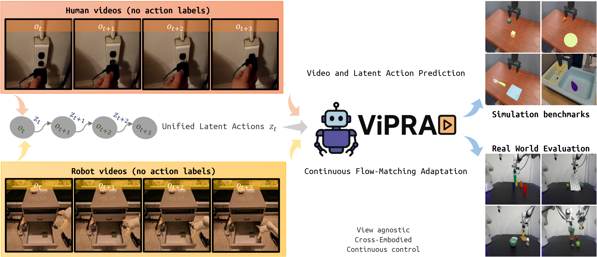

# ViPRA: Video Prediction for Robot Actions

<div align="center">

<picture>
  <!-- Optional: light/dark variants -->
  
</picture>

<p>
    <a href="https://arxiv.org/abs/2511.07732">
        
    </a>
    <a href="https://vipra-project.github.io">
        
    </a>
    <a href="https://github.com/sroutray/vipra">
        
    </a>
    <a href="https://huggingface.co/vipra-project">
        
    </a>
</p>

<h3>
  <a href="https://sroutray.github.io">Sandeep Routray</a><sup>1,2</sup>,
  <a href="https://hengkaipan.github.io">Hengkai Pan</a><sup>1</sup>,
  <a href="https://unnat.github.io">Unnat Jain</a><sup>2,3</sup>,
  <a href="https://shikharbahl.github.io">Shikhar Bahl</a><sup>2</sup>,
  <a href="https://www.cs.cmu.edu/~dpathak/">Deepak Pathak</a><sup>1,2</sup>
</h3>
<h4><sup>1</sup>Carnegie Mellon University <sup>2</sup>Skild AI <sup>3</sup>University of California, Irvine</h4>
<h4>Corresponding author: <a href="mailto:sroutra2@cs.cmu.edu">Sandeep Routray</a></h4>


</div>

## News

- **[2026/01/26]** ViPRA accepted at [ICLR 2026](https://openreview.net/forum?id=w3Ik8HUyTT). 
- **[2025/12/06]** ViPRA won the **Best Paper Award** at [NeurIPS 2025 EWM Workshop](https://embodied-world-models.github.io/). 
- **[2025/10/13]** ViPRA accepted for an **Oral** at [NeurIPS 2025 EWM Workshop](https://embodied-world-models.github.io/). 
- **[2025/10/01]** ViPRA accepted at [NeurIPS 2025 SpaVLE Workshop](https://space-in-vision-language-embodied-ai.github.io/).

---

## Overview
- A recipe to learn generalist robot policies from large-scale human and robot videos without action labels.
- A novel approach to extract motion-centric latent actions that capture fine-grained physical dynamics.
- A flow matching action decoder with action chunking for high-frequency continuous control.
- Outperforms prior latent action methods and VLA baselines trained on ground-truth actions.

---

## Latent Action Model

The latent action model learns motion-centric abstract representations from actionless video. These latents capture fine-grained temporal dynamics and are discretized into tokens that serve as "latent actions" for downstream policy learning.

**Key Features**
- **Actionless Learning**: Learns from videos directly; no action annotations required.
- **Motion-Centric**: Focuses on fine-grained temporal dynamics rather than static appearance.
- **Multi-Dataset**: Trained on diverse human and robot data.
- **Optical Flow Consistency**: Uses optical flow for temporal consistency regularization.

**Architecture**
- **Spatial Encoder**: DINOv2-initialized vision transformer for spatial features.
- **Spatio-Temporal Encoder**: Non-causal transformer encoder over video clips.
- **Vector Quantizer**: Noise Substitution Vector Quantization (NSVQ) for discretizing latent action.
- **Spatio-Temporal Decoder**: Causal transformer decoder for reconstruction.
- **Flow Network**: RAFT-based optical flow estimation for consistency loss.

### Environment Setup
```bash
cd laq/
conda env create -f environment.yml -n laq
conda activate laq
```

### Configuration

Training configs live in [`laq/configs/config.py`](./laq/configs/config.py). Key parameters:

* **Model**: 768-dim transformer, 6 encoder layers, 8 decoder layers.
* **Data**: 224×224 crops, 8-frame sequences.
* **Quantization**: 32-dim latent space, NSVQ codebook.
* **Losses**: L1 reconstruction, LPIPS perceptual loss, optical-flow consistency loss.
* **Training**: ~300k steps, batch size 18, bf16 on 8×H200 GPUs, grad norm clip 6.0.

### Dataset Structure Requirements

You can match these layouts or extend [`laq/model/data.py`](./laq/model/data.py) to support your own.

#### Something-Something-v2 (SSv2)

```text
ssv2/
├── labels/
│   ├── train.json
│   ├── validation.json
│   └── test.json
├── 20bn-something-something-v2/
│   ├── [video_id].webm
│   └── ...
```

Example config:

```python
ssv2 = dict(
    root_dir=Path("/path/to/ssv2"),
    split="trainval",   # "train", "val", "trainval", "test", "all"
    stepsize=2,         # frame sampling stride
)
```

#### OpenX Datasets (Fractal, Bridge, Kuka)

```text
dataset_name/
├── processed/
│   ├── trajectory_001/
│   │   └── images/
│   │       ├── 000000.jpg
│   │       ├── 000001.jpg
│   │       └── ...
│   ├── trajectory_002/
│   └── ...
```

Example config:

```python
bridge = dict(
    root_dir=Path("/path/to/bridge"),
    split="trainval",
    num_trajs=dict(trainval=25460, val=2546),
    stepsize=1,
)
```

#### LIBERO

```text
LIBERO/
├── libero_10_modified/
│   └── images/trajectory_001/000000.jpg
├── libero_goal_modified/
│   └── images/...
├── libero_object_modified/
│   └── images/...
└── libero_spatial_modified/
    └── images/...
```

Example config:

```python
libero = dict(
    root_dir=Path("/path/to/LIBERO"),
    split="trainval",
    num_trajs=dict(trainval=1.0, val=0.1),  # float = percentage
    stepsize=1,
)
```

#### Custom Dataset

1. Add a discovery function in `laq/model/data.py`:

```python
def discover_custom_sequences(data_root: Path, mode: str, **kwargs) -> List[str]:
    # return list of frame directories / trajectories
    return list_of_paths
```

2. Add your dataset case in `VideoDatasetCoTrain`.
3. Add your config block to `laq/configs/config.py`.

### Training
Launch training using the provided script, configured for bf16 training on a single node with 8 H200 GPUs:

```bash
bash run_train_laq.sh
```

### Inference and Evaluation
To reproduce codebook analysis and figures shown in the paper:

```bash
# Codebook usage analysis (reproduces codebook utilization figures)
python -m codebook_usage

# Rollout transfer evaluation (reproduces reconstruction and transfer results)
python -m rollout_transfer
```

To use the LAQ model to generate training data with latent actions for ViPRA policy pretraining, use the dataset-specific latent generation scripts:
```bash
# LIBERO
python -m inference.libero.libero_latent

# OpenX-style datasets (Fractal, BridgeData V2, Kuka)
python -m inference.openx.openx_latent --dataset bridge
python -m inference.openx.openx_latent --dataset kuka

# SSv2
python -m inference.ssv2.ssv2_latent
```

These scripts generate training data in JSONL format with multi-GPU processing and automatic shard merging. Each line contains a training sample with latent actions:

**Sample JSONL Entry:**
```json
{
  "instruction": "pick up the red block and place it in the blue bowl",
  "raw_action": [0.1, -0.2, 0.05, 0.0, 0.0, 0.0, 1.0],
  "image": ["libero_10_modified/images/traj_001/step0000.jpg", "libero_10_modified/images/traj_001/step0001.jpg"],
  "latent_state": ["libero_10_modified/images/traj_001/step0015.jpg"],
  "latent_action_idxs": [3, 7, 1, 4, 2, 6, 0, 5, 1, 3, 7, 2, 4, 0, 6, 1],
  "fields_la": "[instruction],[vision],latent_action",
  "fields_ls": "[instruction],[vision],latent_state", 
  "fields_ls_la": "[instruction],[vision],latent_state,latent_action"
}
```

---

## ViPRA Policy

The ViPRA policy builds on a video-language foundation model, [Large World Model (LWM)](https://github.com/LargeWorldModel/LWM). We use the [LWM-Chat-1M-Jax](https://huggingface.co/LargeWorldModel/LWM-Chat-1M-Jax) as the base model and extend it with additional modules for latent action prediction and flow matching for continuous control.

### Environment Setup

```bash
cd vipra/
conda env create -f environment.yml -n vipra
conda activate vipra
```

Before training, download the VQ-GAN image tokenizer, text tokenizer and pretrained model parameters from [LWM-Chat-1M-Jax](https://huggingface.co/LargeWorldModel/LWM-Chat-1M-Jax) and place them under `vipra/lwm/`:

```bash
mkdir lwm
huggingface-cli download LargeWorldModel/LWM-Chat-1M-Jax --local-dir lwm/
```

### Pretraining Data

We release a pre-tokenized, horizon-14 dynamics dataset on [Hugging Face](https://huggingface.co/datasets/vipra-project/cotrain-dynamics14):

```bash
mkdir cotrain_data
huggingface-cli download vipra-project/cotrain-dynamics14 --local-dir cotrain_data/
```

`cotrain-dynamics14` merges multiple robot datasets (LIBERO, BridgeData V2, Fractal, Kuka) with human video data from SSv2.
Each training sample includes:

* history frames
* latent state target
* latent action tokens from LAQ
* natural language task text

This dataset is already chunked into 14-step latent action sequences.

#### Vision Cache (Optional, speeds up training)

We also release a VQGAN vision cache on [Hugging Face](https://huggingface.co/datasets/vipra-project/cotrain-vqgan-vision-cache) so you don't have to repeatedly tokenize raw pixels:

```bash
mkdir vision_cache
huggingface-cli download vipra-project/cotrain-vqgan-vision-cache --local-dir vision_cache/
```

This contains precomputed VQGAN token sequences for each frame, which can be used instead of running the image tokenizer online.

If you don't use the cache, set `vqgan_path` to the VQ-GAN weights from `LWM-Chat-1M-Jax` so ViPRA can tokenize frames on the fly.

### Running Pretraining

Launch pretraining using the provided script (configured for 8×H200 GPUs):

```bash
cd vipra/
bash scripts/pretrain.sh
```

See [`vipra/scripts/pretrain.sh`](./vipra/scripts/pretrain.sh) for full hyperparameters.

---

### Finetuning

Download the pretrained checkpoint weights, VQ-GAN image tokenizer, and text tokenizer from [Hugging Face](https://huggingface.co/vipra-project/vipra-7b-pretrained):

```bash
cd vipra && mkdir vipra_checkpoints
huggingface-cli download vipra-project/vipra-7b-pretrained --local-dir vipra_checkpoints/
```


For task-specific finetuning, prepare your dataset in JSONL format where each line represents a single timestep with the following structure:

```json
{
  "id": "ep00000/step0000",
  "image": "ep00000/step0000.png",
  "raw_action": [0.016, 0.0, -0.0, 0.0, 0.0, -0.0, -1.0],
  "proprio": [0.003, -0.141, 0.011, -2.431, ...],
  "instruction": "<s> You are a helpful assistant. USER: What action should the robot take to `put the white mug on the left plate` ASSISTANT:"
}
```

We provide a full data processing pipeline example (shown here with LIBERO Long):

**Step 1: Action Discretization**

```bash
python data/finetune_preprocess_libero.py \
  --input_path ./libero_10_raw.jsonl \
  --output_filename ./libero_10_quant.jsonl \
  --csv_filename ./quant_bins.csv \
  --discretize_bins 2047 \
  --task_name libero_10
```

**Step 2: Dynamics Formatting (14-step horizon, history, proprio)**

```bash
python data/dynamics14_libero.py \
  --input_jsonl ./libero_10_quant.jsonl \
  --data_root ./ \
  --csv_path ./quant_bins.csv \
  --horizon 14 \
  --action_type delta-eef \
  --task_name libero_10
```

**Step 3: Action / Proprio Normalization**

```bash
python data/normalize_libero.py \
  --raw_jsonl ./libero_10_raw.jsonl \
  --dynamics_jsonl ./libero_10_dynamics14_v2.jsonl \
  --output_jsonl ./libero_10_final.jsonl \
  --action_stats_json ./action_stats.json \
  --proprio_stats_json ./proprio_stats.json
```

To launch finetuning (for LIBERO Long example):

```bash
cd vipra/
bash scripts/finetune_libero_long.sh
```

See [`vipra/scripts/finetune_libero_long.sh`](./vipra/scripts/finetune_libero_long.sh) for full hyperparameters.

---

## Deployment

ViPRA uses a client–server architecture for deployment: a server that runs inference and a lightweight client that sends observations and receives actions.

### Server

Start the inference server:

```bash
cd vipra/
bash scripts/run_server.sh [GPU_ID] [PORT]

# Examples:
bash scripts/run_server.sh 0 8005
bash scripts/run_server.sh 1         # GPU 1, default port 8005
bash scripts/run_server.sh           # GPU 0, default port 8005
```

The server is configured by the `ViPRAConfig` class in [`vipra/inference/dynamics_action_cont_server.py`](./vipra/inference/dynamics_action_cont_server.py).
Default endpoint: `http://localhost:8005`

### Client

The ViPRAClient class in the client script in  [`vipra/inference/dynamics_action_cont_client.py`](./vipra/inference/dynamics_action_cont_client.py) provides a simple interface to communicate with the inference server and obtain robot actions. The client can be customized for your particular use case and robot platform.

```python
from inference.dynamics_action_cont_client import ViPRAClient
import numpy as np

client = ViPRAClient(
    server_url="http://localhost:8005",
    timeout=(1.0, 5.0),
    image_size=256
)

task_description = "pick up the red block and place it in the blue bowl"
client.reset_policy(task_description)

image1 = np.random.randint(0, 255, (256, 256, 3), dtype=np.uint8)
image2 = np.random.randint(0, 255, (256, 256, 3), dtype=np.uint8)

# Two request modes available:
actions = client.get_action([image1, image2], mode="json")   # JSON mode (baseline)
actions = client.get_action([image1, image2], mode="bytes")  # JPEG mode (faster)
```

**API Endpoints**

1. `POST /step` – JSON payload with images in nested lists.
2. `POST /step_bytes` – multipart form data with JPEG-compressed images (recommended).
3. `POST /reset` – reset policy and set a new task instruction.

### Client-Only Environment

```bash
conda env create -f client_environment.yml -n vipra-client
conda activate vipra-client
```

* Lightweight: only requests, OpenCV, numpy
* No JAX / PyTorch required
* Can run on edge devices, laptops, etc.

---

## Citation

If you find our code or models useful in your work, please cite [ViPRA](https://arxiv.org/abs/2511.07732):

```bibtex
@misc{routray2025vipra,
      title={ViPRA: Video Prediction for Robot Actions}, 
      author={Sandeep Routray and Hengkai Pan and Unnat Jain and Shikhar Bahl and Deepak Pathak},
      year={2025},
      eprint={2511.07732},
      archivePrefix={arXiv},
      primaryClass={cs.RO},
      url={https://arxiv.org/abs/2511.07732}, 
}
```

---

## Acknowledgements

ViPRA builds on [LWM](https://github.com/LargeWorldModel/LWM) and [LAPA](https://github.com/LatentActionPretraining/LAPA). We thank the authors of these projects for open-sourcing their code and models.

---

## License

ViPRA’s code and model weights are released under the [Apache License 2.0](./LICENSE).
